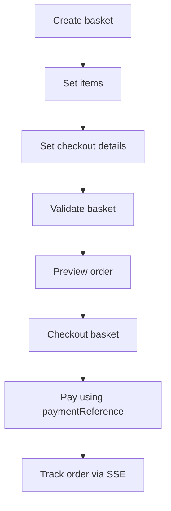

# Circles Market SDK

Typed client for the Circles Market API: catalog browsing, basket/checkout, buyer orders (incl. SSE status events), and offer publishing (via Circles Profiles/IPFS bindings).

## What you get

* **`MarketplaceClient`** as the top-level entry point
* Sub-clients:

    * `auth` — Safe-based sign-in (challenge → SafeMessage signature → JWT)
    * `signers` — SafeMessage EIP-712 signing helper
    * `catalog` — browse operator catalog pages + seller catalog helpers
    * `cart` — baskets, items, checkout details, validate/preview/checkout
    * `orders` — list/get orders + status history + SSE order-status events
    * `offers` — publish/tombstone offers (**requires** `profilesBindings`)

## Install

```bash
pnpm add @circles-market/sdk
# or whatever your package name actually is
```

Runtime expectations:

* **Browser**: works out of the box (uses `fetch`, `TextEncoder`, SSE via `fetch` streaming).
* **Node**: needs Node 18+ (native `fetch`, `TextEncoder`). Older Node requires polyfills.

---

## Quick start

### Create a client

```ts
import { MarketplaceClient } from '@circles-market/sdk';

const client = new MarketplaceClient({
  marketApiBase: 'https://market.aboutcircles.com',
});
```

### Sign in with a Safe avatar (JWT)

```ts
await client.auth.signInWithAvatar({
  avatar: '0xYourSafeAvatarAddress',
  ethereum: window.ethereum,
  chainId: 100, // default is 100 (Gnosis)
});

// Token is stored in the AuthContext (default: in-memory)
const meta = client.auth.getAuthMeta(); // { address, chainId } | null
```

### Browse catalog (operator-scoped)

```ts
const operator = '0xOperatorAddress';
const catalog = client.catalog.forOperator(operator);

const page1 = await catalog.fetchCatalogPage({
  avatars: ['0xSellerA', '0xSellerB'],
  chainId: 100,
  pageSize: 20,
});

// items: AggregatedCatalogItem[]
console.log(page1.items, page1.nextCursor);
```

### Basket → validate → preview → checkout

```ts
const { basketId } = await client.cart.createBasket({
  buyer: '0xBuyerAddress',
  operator,
  chainId: 100,
});

await client.cart.setItems({
  basketId,
  items: [
    { seller: '0xSeller', sku: 'coffee-250g-abc12', quantity: 2, imageUrl: 'https://...' },
  ],
});

await client.cart.setCheckoutDetails({
  basketId,
  shippingAddress: { streetAddress: 'Main St 1', postalCode: '10115', addressLocality: 'Berlin', addressCountry: 'DE' },
  contactPoint: { email: 'buyer@example.com' },
});

const validation = await client.cart.validateBasket(basketId);
if (!validation.valid) {
  // see validation.requirements for server-side “required slots”
  console.log(validation.requirements);
}

const preview = await client.cart.previewOrder(basketId);

const checkout = await client.cart.checkoutBasket({ basketId });
// => { orderId, paymentReference, basketId }
```

### Subscribe to order status SSE

```ts
const unsubscribe = client.orders.subscribeStatusEvents((evt) => {
  // evt: { orderId, oldStatus, newStatus, changedAt }
  console.log(evt.orderId, evt.newStatus);
});

// later
unsubscribe();
```

---

## Concepts

### `MarketplaceClient` and sub-clients

`MarketplaceClient` wires together:

* HTTP transport (`FetchHttpTransport` by default)
* AuthContext (`InMemoryAuthContext` by default)
* sub-clients (`auth`, `orders`, `cart`, `catalog`, optionally `offers`)

If you want offers publishing, pass `profilesBindings`:

```ts
import { MarketplaceClient } from '@circles-market/sdk';
import type { ProfilesBindings } from '@circles-market/sdk';

const profilesBindings: ProfilesBindings = /* provided by your profiles/IPFS integration */;

const client = new MarketplaceClient({
  marketApiBase: 'https://market.aboutcircles.com',
  profilesBindings,
});
```

### Address normalization

A lot of the SDK assumes addresses are real EVM addresses and often normalizes them.

Use:

```ts
import { normalizeEvmAddress, isEvmAddress } from '@circles-market/sdk';

const addr = normalizeEvmAddress('0xAbc...'); // lowercased, throws if invalid
```

### SKU format

SKU is validated by:

* `isValidSku(sku)` and `assertSku(sku)`
* regex: `^[a-z0-9][a-z0-9-_]{0,62}$`

This matches the constraints used by the app flow.

---

## Auth and signing

### How sign-in works

`auth.signInWithAvatar(...)` does:

1. POST `/api/auth/challenge` → `{ challengeId, message }`
2. Signs the UTF-8 bytes of `message` via Safe EIP-712:

    * domain: `{ chainId, verifyingContract: avatarSafe }`
    * primaryType: `SafeMessage`
    * message: `{ message: 0x…bytes }`
3. POST `/api/auth/verify` with `{ challengeId, signature }` → `{ token, expiresIn, address, chainId }`
4. Stores token via `AuthContext.setToken(...)`

### Chain enforcement

`signInWithAvatar` internally creates a Safe signer with `enforceChainId: true`.
That means:

* wallet must be on the expected chain (`eth_chainId` must match), or sign-in throws.

### AuthContext choices

Default is `InMemoryAuthContext` (token dies on refresh).
If you want persistence (like the app), implement your own `AuthContext` (localStorage, indexedDB, etc.) and pass it into `MarketplaceClientOptions`.

Minimal interface:

```ts
export interface AuthContext {
  getToken(): string | null;
  setToken(token: string, expSeconds: number, addr: string, chainId: number): void;
  clear(): void;
  getMeta(): { address: string; chainId: number } | null;
}
```

---

## Catalog API

### Fetch operator catalog page

```ts
const page = await client.catalog.fetchCatalogPage({
  operator: '0xOperator',
  avatars: ['0xSeller'],
  chainId: 100,
  pageSize: 20,
  cursor: null,
});
```

### Convenience helpers

```ts
const catalog = client.catalog.forOperator('0xOperator');

// list items for a single seller
const items = await catalog.fetchSellerCatalog('0xSeller', { chainId: 100 });

// fetch one product by seller+sku (paginates internally)
const item = await catalog.fetchProductForSellerAndSku('0xSeller', 'coffee-250g-abc12');
```

Notes:

* Catalog uses `fetch` directly (not `HttpTransport`).
* It caches pages for ~10s (up to 200 entries) to avoid duplicate calls in reactive UIs.
* On HTTP `416`, it returns an empty page and `status: 416`.

---

## Cart API

### Basket lifecycle



### Types you’ll use

From `cartTypes.ts`:

* `BasketItemInput` — `{ seller, sku, quantity, imageUrl? }`
* `PostalAddressInput` — shipping/billing fields
* `ContactPointInput` — email/telephone
* `PersonMinimalInput` — `{ birthDate?: string }`
* `ValidationResult` — `{ valid, requirements, missing, ruleTrace }`
* `Basket` — server basket object (forward-compatible, `[k: string]: unknown`)

### Server “required slots”

Validation results contain requirements from the backend. The UI in your app treats these as “required slots” such as:

* `contactPoint.email`
* `contactPoint.telephone`
* `ageProof.birthDate`
* `shippingAddress.streetAddress`
* etc.

The SDK does not enforce these rules client-side; it surfaces them via `validateBasket`.

---

## Orders API

### Listing and fetching

All buyer-scoped order endpoints require a token in `AuthContext`.

```ts
const orders = await client.orders.list({ page: 1, pageSize: 50 });

const snap = await client.orders.getById('ORDER-123');
const hist = await client.orders.getStatusHistory('ORDER-123');
```

### SSE order status events

```ts
const stop = client.orders.subscribeStatusEvents((evt) => {
  // evt.newStatus is a schema.org IRI, e.g. https://schema.org/PaymentComplete
});

stop();
```

Behavior notes:

* The SSE implementation is intentionally minimal:

    * It **does not** auto-reconnect.
    * It **swallows** stream errors; consumers can re-subscribe if needed.
* There’s a convenience helper `onOrderDelivered(handler)` that fires on:

    * `https://schema.org/OrderDelivered`
    * `https://schema.org/PaymentComplete`
      and then fetches the full snapshot via `getById`.

### Public batch lookup (no auth)

```ts
const items = await client.orders.getOrdersBatch(['ORDER-1', 'ORDER-2']);
```

---

## Offers publishing

Offers publishing is optional (`client.offers` is only created when `profilesBindings` is passed).

### Publish offer

```ts
const offers = client.offers;
if (!offers) {
  throw new Error('offers client not configured');
}

const safeSigner = await client.signers.createSafeSignerForAvatar({
  avatar: '0xYourSafeAvatar',
  ethereum: window.ethereum,
  chainId: 100n,
  enforceChainId: true,
});

const res = await offers.publishOffer({
  avatar: '0xYourSafeAvatar',
  operator: '0xOperator',
  signer: safeSigner,
  chainId: 100,
  paymentGateway: '0xGatewayOrSafe', // optional; defaults to avatar
  product: {
    sku: 'coffee-250g-abc12',
    name: 'Coffee 250g',
    description: '…',
    image: ['https://…'], // must be absolute URLs here
  },
  offer: {
    price: 12.5,
    priceCurrency: 'CRC',
    requiredSlots: ['contactPoint.email'],
    fulfillmentEndpoint: 'https://…', // optional, absolute
    fulfillmentTrigger: 'confirmed',  // optional
  },
});

console.log(res.productCid, res.indexCid, res.profileCid, res.digest32);
```

What happens under the hood:

* Builds product JSON-LD (`buildProduct`)
* Adds a `PayAction` on the first offer:

    * `recipient.@id = eip155:${chainId}:${payTo}`
    * `payTo = paymentGateway ?? avatar`
* Stores product and link via profiles bindings:

    * pins JSON-LD
    * creates/signed `CustomDataLink` (`canonicaliseLink`, `signBytes`)
    * updates namespace head+index
    * updates avatar profile digest on-chain (`updateAvatarProfileDigest`)
* Returns:

    * `productCid`, `headCid`, `indexCid`, `profileCid`
    * `digest32` (derived from `profileCid`)
    * optional `txHash` (normalized to 32-byte hex when present)

### Tombstone (remove listing)

```ts
await offers.tombstone({
  avatar: '0xYourSafeAvatar',
  operator: '0xOperator',
  signer: safeSigner,
  sku: 'coffee-250g-abc12',
});
```

### URL and size validation

`buildProduct` enforces:

* `offer.price > 0`
* `offer.priceCurrency` is `^[A-Z]{3}$`
* URL fields must be absolute (`isAbsoluteUri`)
* JSON-LD size cap: **8 MiB** (`ObjectTooLargeError`)

Errors you may see:

* `CurrencyCodeError`
* `UrlValidationError`
* `ObjectTooLargeError`

---

## HTTP transport and errors

### Default transport

Most clients use `FetchHttpTransport` (JSON + JSON-LD).

On non-2xx responses it throws `HttpError`:

```ts
import { HttpError } from '@circles-market/sdk';

try {
  await client.cart.validateBasket('...');
} catch (e) {
  if (e instanceof HttpError) {
    console.log(e.status, e.body);
  }
}
```

### Custom transport

If you need retries, tracing, alternate fetch, etc.:

```ts
import type { HttpTransport, HttpRequestOptions } from '@circles-market/sdk';

class MyTransport implements HttpTransport {
  async request<T>(opts: HttpRequestOptions): Promise<T> {
    // wrap fetch / add retries / metrics
    throw new Error('not implemented');
  }
}

const client = new MarketplaceClient({
  marketApiBase: 'https://market.aboutcircles.com',
  http: new MyTransport(),
});
```

---

## Utilities

Exported from `utils.ts`:

* `normalizeEvmAddress`, `isEvmAddress`
* `isAbsoluteUri`
* `isValidSku`, `assertSku`
* `normalizeHex32`, `normalizeHex32`-style helpers
* `Hex` type alias

CID helpers are re-exported from `@circles-profile/core`:

* `cidV0ToDigest32Strict`
* `tryCidV0ToDigest32`

---